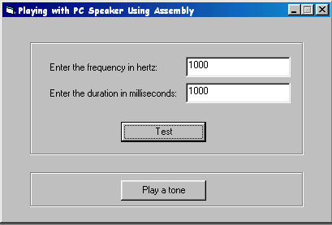



## Playing with PC speaker using VB & Assembly

### Description

There is a API function in WinNT based systems - BeepAPI function. You can create sounds of any frequency and for duration by using that function. But the BeepAPI function in Win98 is very limited. It can't do it. So, I made this class in assembly that can do the same work in Win98 also. I haven't tested this code in other machines. But it should work. Please, report to me if it doesn't work. Comments and votes are welcome.
 
### More Info
 

             |
---                |---
**Submitted On**   |2002-10-31 00:03:50
**By**             |[Isbat Sakib](https://github.com/Planet-Source-Code/PSCIndex/blob/master/ByAuthor/isbat-sakib.md)
**Level**          |Intermediate
**User Rating**    |4.3 (17 globes from 4 users)
**Compatibility**  |VB 5\.0, VB 6\.0
**Category**       |[Miscellaneous](https://github.com/Planet-Source-Code/PSCIndex/blob/master/ByCategory/miscellaneous__1-1.md)
**World**          |[Visual Basic](https://github.com/Planet-Source-Code/PSCIndex/blob/master/ByWorld/visual-basic.md)
**Archive File**   |[Playing\_wi14948511102002\.zip](https://github.com/Planet-Source-Code/isbat-sakib-playing-with-pc-speaker-using-vb-assembly__1-40580/archive/master.zip)

